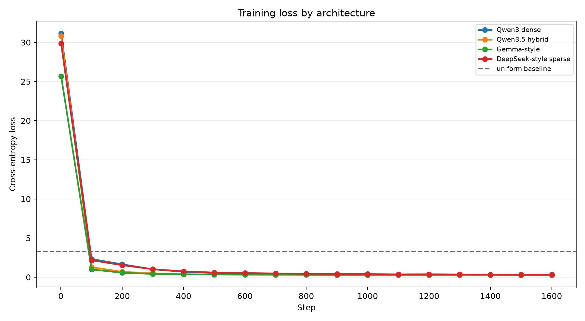
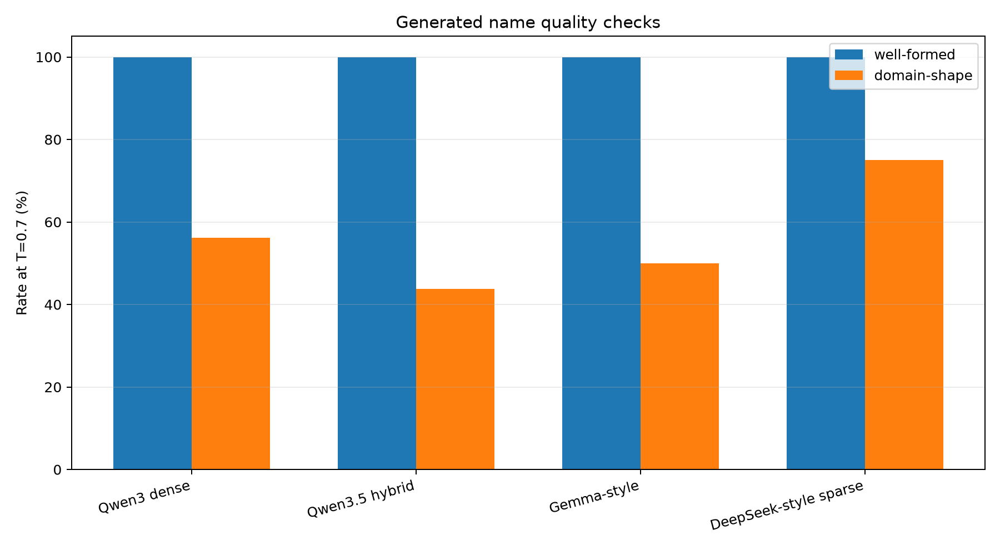
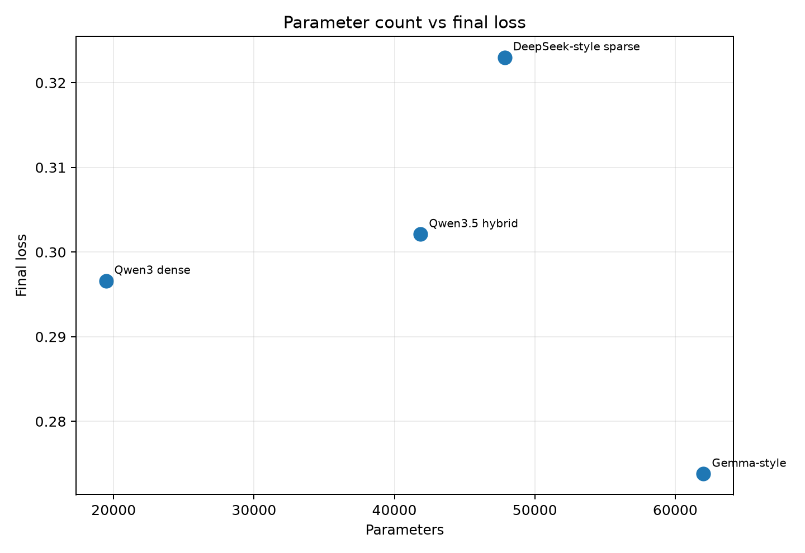

# AI Security Tiny Architectures

Bu proje, karakter tabanlı minyatür transformer modelleriyle hayali ama gerçekçi
AI security tool adları üretir.

Amaç, tek karakterli tokenizer kullanan küçük dil modellerinin kısa ve domain
odaklı bir isim corpus'undan kalıp öğrenip öğrenemediğini göstermektir.

## Veri

Dataset `data/build_tool_names.py` ile deterministik olarak üretilir ve
`data/tool_names.txt` dosyasına yazılır.

Corpus, AI agent güvenliği ve siber güvenlik alanında sık geçen parçalardan
oluşur:

```text
agent, prompt, guard, shield, token, vault, secret, scanner,
context, policy, jailbreak, llm, trust, firewall, sentry
```

Örnek satırlar:

```text
agentguard
agentshield
contextlock
guardrailscan
jailbreakwatch
llmfirewall
promptarmor
promptguard
redteamlens
secretscanner
tokensentry
vaultguard
```

## Tokenizer

Bu çalışmada single-letter tokenization kullanılır:

- Her karakter bir tokendir.
- `\n` karakteri hem satır ayırıcı hem de EOS token gibi kullanılır.
- Vocabulary doğrudan `data/tool_names.txt` içindeki karakterlerden çıkarılır.

Bu yapı özellikle kısa isim üretimi için yeterlidir. Model kelime veya alt-kelime
tokenları değil, karakter geçişlerini öğrenir.

## Modeller

Dört küçük mimari aynı veri, aynı tokenizer ve aynı eğitim ayarlarıyla
karşılaştırılır:

| Model | Kısa açıklama |
|---|---|
| Qwen3 dense | RMSNorm, RoPE, grouped-query attention, SwiGLU |
| Qwen3.5 hybrid | Gated DeltaNet linear attention + full attention |
| Gemma-style | Sliding-window/global attention, sandwich norm, GeGLU |
| DeepSeek-style sparse | MLA compressed-KV attention + tiny MoE |

Karşılaştırmanın amacı büyük model performansı iddiası değil; farklı mimari
fikirlerin aynı küçük görev üzerinde uçtan uca çalışmasını ve üretim kalitesini
gözlemlemektir.

## Sonuçlar

Eğitim tamamlandığında script şu çıktıları üretir:

- `reports/training_results.json`
- `reports/model_comparison.md`
- `assets/training_loss.png`
- `assets/generation_quality.png`
- `assets/params_vs_loss.png`
- `checkpoints/*.pt`

Bu koşuda modeller CPU üzerinde `1600` adım eğitildi. Uniform baseline loss
`ln(vocab_size) = 3.2581`; tüm modeller bunun oldukça altına indi.

| Model | Params | Final loss | Time (s) | Well-formed %@0.7 | Domain-shape %@0.7 |
|---|---:|---:|---:|---:|---:|
| Qwen3 dense | 19,456 | 0.2966 | 14.08 | 100% | 56% |
| Qwen3.5 hybrid | 41,864 | 0.3021 | 67.51 | 100% | 44% |
| Gemma-style | 62,016 | 0.2738 | 49.28 | 100% | 50% |
| DeepSeek-style sparse | 47,848 | 0.3230 | 37.89 | 100% | 75% |

### Training Loss



### Generation Quality



### Params vs Loss



## Üretilen Örnekler

`T=0.7` daha güvenli ve corpus'a daha yakın üretim yapar:

| Model | Örnek çıktılar |
|---|---|
| Qwen3 dense | `toolscan`, `memorycheck`, `memoryguard`, `policyai`, `trustcloud`, `redteamguard` |
| Qwen3.5 hybrid | `agentstack`, `aibeacon`, `credentiallock`, `toolwatch`, `sessionscanner`, `contextcheck` |
| Gemma-style | `autonomystack`, `airadar`, `sessioncheck`, `tokenai`, `trustdefense`, `credentialai` |
| DeepSeek-style sparse | `jailbreakcloud`, `airadar`, `guardguard`, `contexttrace`, `toolops`, `trustlock` |

Daha yüksek sıcaklıklarda model daha yaratıcı ama daha fazla bozulmuş isim üretir.
Örneğin `T=1.2` tarafında `agentstacon`, `jailbreakcheakclab`,
`sessiondentitrack` gibi hatalı veya garip birleşimler görülebilir.

## Kalite Kontrolleri

Üretilen adlar iki basit metrikle değerlendirilir:

| Metrik | Anlamı |
|---|---|
| Well-formed | Çıktı boş değil, 5-24 karakter arası, lowercase ASCII harflerden oluşuyor |
| Domain-shape | Çıktı en az bir security fragment ve en az bir action/tool fragment içeriyor |

Bu metrikler semantik doğruluk iddiası taşımaz. Sadece kısa isim üretimi için
biçimsel ve domain'e yakınlık kontrolü sağlar.

## Çalıştırma

Kurulum:

```bash
python3 -m venv .venv
.venv/bin/python -m pip install -r requirements.txt
```

Dataset oluşturma:

```bash
.venv/bin/python data/build_tool_names.py
```

Tüm modelleri eğitme ve grafikleri üretme:

```bash
.venv/bin/python scripts/train_models.py
```

Daha kısa test koşusu için:

```bash
ASTNG_STEPS=300 .venv/bin/python scripts/train_models.py
```

## Dosya Yapısı

| Yol | Açıklama |
|---|---|
| `data/build_tool_names.py` | Deterministik dataset üretici |
| `data/tool_names.txt` | Eğitim corpus'u |
| `models/` | Kopyalanan minyatür mimari klasörleri |
| `scripts/train_models.py` | Ortak eğitim, örnekleme, raporlama ve grafik scripti |
| `reports/` | JSON ve Markdown sonuç raporları |
| `assets/` | README grafikleri |
| `checkpoints/` | Eğitilen model checkpoint dosyaları |

## Kaynak Notu

`models/` altındaki minyatür mimari klasörleri `single_letter_transformers`
kaynak kodundan alınmıştır. Bu projedeki dataset, ortak eğitim scripti,
raporlama metrikleri, grafikler ve README kurgusu AI security tool name
generation fikrine özel olarak hazırlanmıştır.
